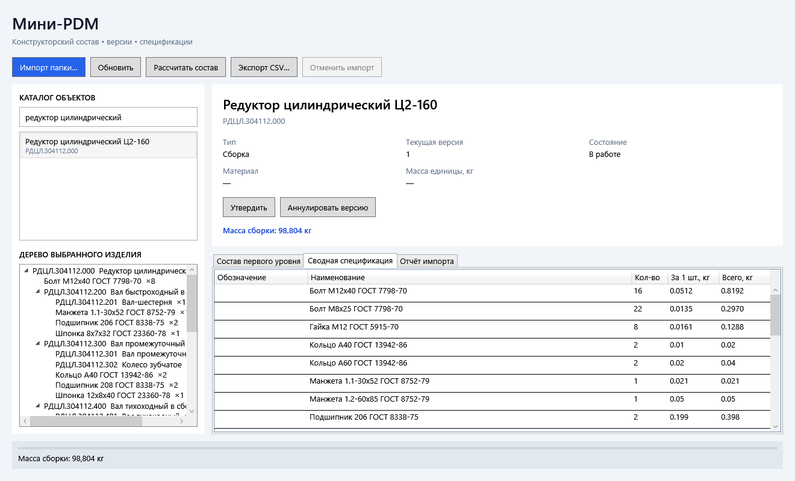
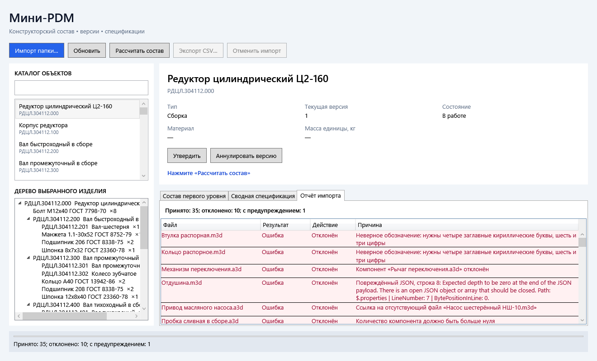

Мини-PDM: состав изделия

Десктопное приложение для импорта конструкторского состава из CAD-документов, ведения версий, расчёта массы и сводной спецификации. Реализована обязательная часть задания; дополнительно — фоновый импорт с отменой и экспорт спецификации в CSV.

Стек: .NET 8, WPF, SQLite, Dapper, xUnit. Комментарии и сообщения интерфейса — на русском. Сложные правила отделены от SQL и интерфейса.

Сборка и запуск

Нужны Windows и .NET 8 SDK. Visual Studio необязательна. При первом восстановлении пакетов нужен доступ к NuGet. Команды выполняются из папки с MiniPdm.sln:

powershell
dotnet build
dotnet test
dotnet run --project src/MiniPdm.Desktop

Можно открыть MiniPdm.sln в Visual Studio 2022 и выбрать MiniPdm.Desktop стартовым проектом.

База автоматически создаётся в %LOCALAPPDATA%\MiniPdm\minipdm.db. Установка сервера БД и ручное выполнение SQL не нужны. Для отдельной базы можно задать строку подключения:

powershell
$env:MINIPDM_CONNECTION = Data Source=C:\your-existing-folder\minipdm.db
dotnet run --project src/MiniPdm.Desktop

Папка для пользовательской строки подключения должна существовать. Чтобы повторить демонстрацию с чистой БД, укажите новое имя файла базы.

Как проверить задание

1. Нажмите «Импорт папки…», выберите samples/cad-export. После завершения откроется вкладка отчёта. Ошибки показаны первыми.
2. Введите в поиск редуктор и выберите «Редуктор цилиндрический Ц2-160». Внизу слева появится его дерево; выбор узла обновляет карточку справа.
3. Нажмите «Рассчитать состав». Масса — 98,804 кг, спецификация — 25 уникальных позиций.
4. Повторите импорт той же папки: все 35 принятых объектов останутся без изменений.
5. Для демонстрации новых версий утвердите «Колесо зубчатое» и «Крышка подшипника в сборе» через карточки.
6. Импортируйте samples/cad-export-v2. У этих двух объектов появятся версии №2 «В работе». Если перед импортом их не утверждать, обновятся версии №1.
7. Рассчитайте редуктор повторно: 98,880 кг. В новой версии крышки 4 регулировочные прокладки вместо 3, а масса колеса изменилась с 5,86 на 5,92 кг.
8. Выберите «Маслоуказатель в сборе»: спецификация доступна, но вместо неполной массы выводится имя детали с неизвестной массой — «Прокладка маслоуказателя».

Кнопка «Аннулировать версию» действует на текущую версию выбранного объекта. После аннулирования показывается предыдущая неаннулированная версия, если она есть. Обратного перехода состояния нет. Изменение атрибутов и состава выполняется повторным импортом CAD-документов.

Изображения получены рендерингом настоящих WPF-контролов через проверку интерфейса, а не нарисованы отдельно.

## Результаты на приложенном наборе

| Действие | Принято | Отклонено | С предупреждением |
|---|---:|---:|---:|
| cad-export | 35 | 10 | 1 |
| Повтор cad-export | 35 без изменений | 10 | 1 |
| cad-export-v2 | 33 без изменений, 2 изменены | 10 | 1 |

Предупреждения входят в число принятых, а не прибавляются к нему. В каждой папке 45 CAD-файлов; README.txt не является документом CAD и не импортируется.

Найденные ошибки:

- Втулка распорная.m3d: латинская 'P' в обозначении вместо кириллической буквы.
- Кольцо распорное.m3d: пять цифр вместо шести в средней группе обозначения.
- Шайба стопорная.m3d, Шайба упорная.m3d: одинаковое обозначение; отклонены обе.
- Отдушина.m3d: незавершённый JSON.
- Привод масляного насоса.a3d: нет файла насоса.
- Пробка сливная в сборе.a3d: количество компонента равно нулю.
- Рычаг переключения.a3d и Тяга переключения.a3d: цикл.
- Механизм переключения.a3d: содержит отклонённый рычаг.
- Предупреждение: у Прокладка маслоуказателя.m3d не указана масса.

Подробный отчёт по каждому файлу, спецификация и оба сценария версий: [docs/import-report.md](docs/import-report.md). Отчёт воспроизводится без изменения рабочей базы:

powershell
dotnet run --project tools/MiniPdm.Report -- samples docs/import-report.md

Архитектура

| Проект | Ответственность |
|---|---|
| MiniPdm.Core | Модель, валидация, граф, импорт, расчёты, интерфейсы зависимостей. Нет JSON, файловой системы, SQL или WPF. |
| MiniPdm.Infrastructure | CAD-адаптер JSON, SQLite, Dapper, транзакции, SQL-схема и рекурсивный запрос. |
| MiniPdm.Desktop | WPF/MVVM: привязки, команды, дерево, карточка, диалоги. |
| MiniPdm.Tests | xUnit: правила, расчёты, версии, импорт с подменой CAD; отдельно интеграционные проверки файлов и БД. |
| MiniPdm.Report | Воспроизводимый текстовый отчёт на исходных наборах. |
| MiniPdm.UiSmoke | Проверка команд ViewModel, XAML-привязок и рендеринг экранов. |

Зависимости собираются вручную в App.xaml.cs. Для небольшого приложения контейнер не нужен. Все сервисы получают зависимости через конструкторы. В MainWindow.xaml.cs только InitializeComponent; логика интерфейса находится в MainViewModel.

База данных и запрос состава

Скрипт схемы: src/MiniPdm.Infrastructure/Sql/Schema.sql. Он включён в сборку как ресурс и выполняется при старте. Используются таблицы pdm_object, object_version, bom_link, внешние ключи, уникальные индексы и ограничения количества. Триггеры защищают атрибуты и связи утверждённых/аннулированных версий и проверяют переходы состояний.

Отличия от рекомендованной схемы:

- Наименование хранится в версии, чтобы изменение имени утверждённого объекта не переписывало историю. Идентичность стандартного изделия всё равно определяется его наименованием; его переименование означает другой объект.
- Вместо избыточного current_version_id используется представление current_version, выбирающее последнюю неаннулированную версию. Так указатель не может рассинхронизироваться. Для небольшого набора это проще, а индекс по объекту и версии поддерживает поиск.
- identity — уникальный бизнес-ключ с префиксом: D: + обозначение для детали/сборки, N: + имя для стандартного изделия.
- Масса хранится как TEXT с точным представлением decimal в инвариантной культуре. Это особенность SQLite: REAL теряет десятичную точность. Dapper читает значение в decimal?; арифметика выполняется в C# без double.

Sql/Tree.sql получает всё дерево одним запросом WITH RECURSIVE. Каждое вхождение сохраняет собственный путь; общая деталь на нескольких ветках не теряется. Запрос включает корень и сигнализирует цикл, останавливая его обход. Расчёт в C# перемножает количества по пути и складывает количества одинаковых объектов. Переполнение выдаёт ошибку вместо округлённого результата.

Все принятые объекты одной папки записываются одной транзакцией. Чтение и первичная проверка выполняются до транзакции, чтобы не держать блокировку во время чтения файлов. Проверка существующих объектов, итогового графа и запись — внутри транзакции. Исключение или отмена до фиксации откатывают все изменения. Ошибки отдельных документов исключают их из записи, но не прерывают обработку остальных.

Принятые решения в неоднозначных случаях

- Отсутствие массы допустимо с предупреждением только у детали, как прямо указано в правилах задания. У стандартного изделия это ошибка. Нулевая масса допустима, отрицательная — нет.
- Пустая сборка допустима; масса равна нулю.
- Если у дочернего объекта аннулированы все версии, расчёт завершается ошибкой с именем объекта. Такое вхождение видно в дереве; оно не подменяется нулём.
- Если все версии объекта аннулированы, следующий импорт создаёт новую «В работе» с номером MAX(version_no)+1. Номера не переиспользуются.
- Утверждённая сборка продолжает ссылаться на объекты, поэтому её вычисленная масса меняется при смене текущей версии потомка. Это следует из задания; неизменяемым остаётся её собственный состав.
- Файл, отклонённый в новом импорте, не удаляет уже сохранённый объект. Родитель из того же импорта всё равно отклоняется; старая запись БД не маскирует ошибку текущей папки.
- Имена CAD-файлов сопоставляются без учёта регистра, как на Windows. Обозначения проверяются строго; бизнес-идентификаторы сравниваются с учётом регистра. Пробелы и неверные символы не исправляются автоматически.
- Несколько строк одного компонента складываются в одну связь. Сумма должна помещаться в Int32. Порядок компонентов не считается изменением.
- Несовпадение fileName с именем файла, неверное расширение, неподдерживаемая formatVersion, ссылки за пределы папки и неизвестный тип — ошибки документа.
- Помимо ICadDocumentReader введён ICadCatalog для перечисления документов. Это позволяет полностью подменить CAD API в тестах, не оставляя Directory в бизнес-логике. Сигнатура ReadAsync(string path, CancellationToken) сохранена.
- Смена типа существующего объекта запрещена. Аннулирование версии, которое восстановило бы циклический старый состав, откатывается с понятной ошибкой.
- SQLite выполняет операции синхронно; ViewModel запускает импорт и запросы в фоновом потоке. Отмена импорта проверяется между документами, записями и перед Commit. После фиксации отмена уже не откатывает завершённую операцию.

Проверки

44 теста xUnit прошли. Покрыты точный формат обозначений, все переходы состояний, повторяющиеся компоненты, вложенные количества, общие потомки, отсутствие массы, циклы и родители циклов, транзакционный откат, версия после аннулирования, неизменность утверждённого состава, оба исходных набора и сохранение SQLite на диске. Основные тесты импорта используют подмену CAD и SQLite в памяти, не файловую систему.

Дополнительная проверка интерфейса:

powershell
dotnet run --project tools/MiniPdm.UiSmoke -- samples docs

Она проверяет импорт, поиск по кириллице, выбор узла, расчёт, утверждение, повторный импорт v2, аннулирование, отсутствие массы и ошибки XAML-привязок. Окно не выводится на рабочий стол; экраны сохраняются в PNG. Диалоги выбора папки/файла в этой проверке подменены.

Ограничения и дальнейшее развитие

Обязательная часть выполнена. Из дополнительных пунктов не реализованы ленивая загрузка дерева, PostgreSQL/MS SQL, Jab, Docker, сравнение исторических версий и структурированный журнал. История версий сохраняется, но отдельного экрана истории нет. Для больших сборок следующим шагом стали бы виртуализация/ленивая загрузка, серверная БД и нагрузочные тесты; для сравнения версий достаточно сопоставить сохранённые bom_link по child_object_id. Схема пока создаётся начальным идемпотентным скриптом; для последующих изменений нужны нумерованные миграции.

Приложение рассчитано на локальную работу одного пользователя и небольшие инженерные составы. Для многопользовательской работы понадобятся серверная БД, контроль конкурентных правок и права доступа. Windows-диалоги вручную не автоматизированы; проверены команды и привязки WPF.
